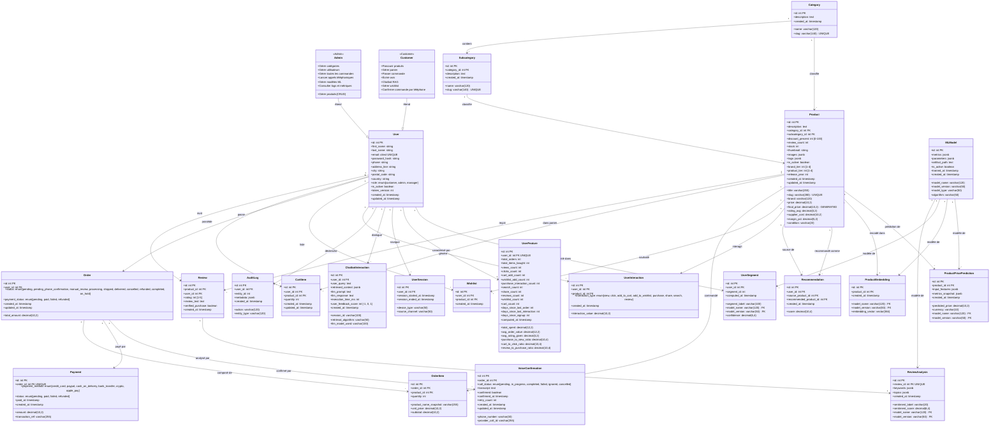

```mermaid
classDiagram

    %% ─── ACTEURS ───

    class Admin {
        <<Admin>>
        +Gérer produits (CRUD)
        +Gérer catégories
        +Gérer utilisateurs
        +Gérer toutes les commandes
        +Lancer appels téléphoniques
        +Gérer modèles ML
        +Consulter logs et métriques
    }

    class Customer {
        <<Customer>>
        +Parcourir produits
        +Gérer panier
        +Passer commande
        +Écrire avis
        +Chatbot RAG
        +Gérer wishlist
        +Confirmer commande par téléphone
    }

    %% ─── ENTITÉS PRINCIPALES ───

    class User {
        +id: int PK
        +first_name: string
        +last_name: string
        +email: citext UNIQUE
        +password_hash: string
        +phone: string
        +address_line: string
        +city: string
        +postal_code: string
        +country: string
        +role: enum[customer, admin, manager]
        +is_active: boolean
        +token_version: int
        +created_at: timestamp
        +updated_at: timestamp
    }

    class Category {
        +id: int PK
        +name: varchar(120)
        +slug: varchar(140) UNIQUE
        +description: text
        +created_at: timestamp
    }

    class Subcategory {
        +id: int PK
        +category_id: int FK
        +name: varchar(120)
        +slug: varchar(140) UNIQUE
        +description: text
        +created_at: timestamp
    }

    class Product {
        +id: int PK
        +title: varchar(255)
        +slug: varchar(280) UNIQUE
        +description: text
        +brand: varchar(120)
        +category_id: int FK
        +subcategory_id: int FK
        +price: decimal(10,2)
        +discount_percent: int [0-100]
        +final_price: decimal(10,2) GENERATED
        +rating_avg: decimal(3,2)
        +review_count: int
        +stock: int
        +thumbnail: string
        +images: jsonb
        +tags: jsonb
        +is_active: boolean
        +supplier_cost: decimal(10,2)
        +margin_pct: decimal(5,2)
        +brand_tier: int [1-4]
        +product_tier: int [1-4]
        +condition: varchar(20)
        +release_year: int
        +created_at: timestamp
        +updated_at: timestamp
    }

    class Review {
        +id: int PK
        +product_id: int FK
        +user_id: int FK
        +rating: int [1-5]
        +review_text: text
        +verified_purchase: boolean
        +created_at: timestamp
    }

    class CartItem {
        +id: int PK
        +user_id: int FK
        +product_id: int FK
        +quantity: int
        +created_at: timestamp
        +updated_at: timestamp
    }

    class Order {
        +id: int PK
        +user_id: int FK
        +status: enum[pending, pending_phone_confirmation, manual_review, processing, shipped, delivered, cancelled, refunded, completed, on_hold]
        +total_amount: decimal(10,2)
        +payment_status: enum[pending, paid, failed, refunded]
        +created_at: timestamp
        +updated_at: timestamp
    }

    class OrderItem {
        +id: int PK
        +order_id: int FK
        +product_id: int FK
        +product_name_snapshot: varchar(255)
        +quantity: int
        +unit_price: decimal(10,2)
        +subtotal: decimal(10,2)
    }

    class Payment {
        +id: int PK
        +order_id: int FK UNIQUE
        +payment_method: enum[credit_card, paypal, cash_on_delivery, bank_transfer, crypto, apple_pay]
        +amount: decimal(10,2)
        +status: enum[pending, paid, failed, refunded]
        +transaction_ref: varchar(255)
        +paid_at: timestamp
        +created_at: timestamp
    }

    class Wishlist {
        +id: int PK
        +user_id: int FK
        +product_id: int FK
        +created_at: timestamp
    }

    class UserInteraction {
        +id: int PK
        +user_id: int FK
        +product_id: int FK
        +interaction_type: enum[view, click, add_to_cart, add_to_wishlist, purchase, share, search, review]
        +interaction_value: decimal(10,2)
        +created_at: timestamp
    }

    class Recommendation {
        +id: int PK
        +user_id: int FK
        +source_product_id: int FK
        +recommended_product_id: int FK
        +score: decimal(10,4)
        +created_at: timestamp
    }

    class ReviewAnalysis {
        +id: int PK
        +review_id: int FK UNIQUE
        +sentiment_label: varchar(20)
        +sentiment_score: decimal(6,4)
        +keywords: jsonb
        +topics: jsonb
        +model_name: varchar(120) FK
        +model_version: varchar(50) FK
        +created_at: timestamp
    }

    class ProductEmbedding {
        +id: int PK
        +product_id: int FK
        +model_name: varchar(120) FK
        +model_version: varchar(50) FK
        +embedding_vector: vector(384)
        +created_at: timestamp
    }

    class VoiceConfirmation {
        +id: int PK
        +order_id: int FK
        +phone_number: varchar(30)
        +call_status: enum[pending, in_progress, completed, failed, ignored, cancelled]
        +transcript: text
        +confirmed: boolean
        +confirmed_at: timestamp
        +retry_count: int
        +provider_call_id: varchar(255)
        +created_at: timestamp
        +updated_at: timestamp
    }

    class AuditLog {
        +id: int PK
        +user_id: int FK
        +action: varchar(120)
        +entity_type: varchar(120)
        +entity_id: int
        +metadata: jsonb
        +created_at: timestamp
    }

    %% ─── ENTITÉS ML ───

    class MLModel {
        +id: int PK
        +model_name: varchar(120)
        +model_version: varchar(50)
        +model_type: varchar(50)
        +algorithm: varchar(50)
        +metrics: jsonb
        +parameters: jsonb
        +artifact_path: text
        +is_active: boolean
        +trained_at: timestamp
        +created_at: timestamp
    }

    class UserFeature {
        +id: int PK
        +user_id: int FK UNIQUE
        +total_orders: int
        +total_spent: decimal(12,2)
        +avg_order_value: decimal(12,2)
        +total_items_bought: int
        +views_count: int
        +clicks_count: int
        +cart_add_count: int
        +wishlist_add_count: int
        +purchase_interaction_count: int
        +search_count: int
        +share_count: int
        +reviews_count: int
        +avg_rating_given: decimal(3,2)
        +wishlist_count: int
        +cart_count: int
        +days_since_last_order: int
        +days_since_last_interaction: int
        +days_since_signup: int
        +purchase_to_view_ratio: decimal(10,4)
        +cart_to_click_ratio: decimal(10,4)
        +review_to_purchase_ratio: decimal(10,4)
        +computed_at: timestamp
    }

    class UserSegment {
        +id: int PK
        +user_id: int FK
        +segment_id: int
        +segment_label: varchar(100)
        +model_name: varchar(120) FK
        +model_version: varchar(50) FK
        +confidence: decimal(6,4)
        +computed_at: timestamp
    }

    class ProductPricePrediction {
        +id: int PK
        +product_id: int FK
        +predicted_price: decimal(10,2)
        +currency: varchar(10)
        +model_name: varchar(120) FK
        +model_version: varchar(50) FK
        +input_features: jsonb
        +metrics_snapshot: jsonb
        +created_at: timestamp
    }

    class UserSession {
        +id: int PK
        +user_id: int FK
        +session_started_at: timestamp
        +session_ended_at: timestamp
        +device_type: varchar(50)
        +source_channel: varchar(50)
    }

    class ChatbotInteraction {
        +id: int PK
        +user_id: int FK
        +session_id: varchar(100)
        +user_query: text
        +retrieval_algorithm: varchar(50)
        +retrieved_context: jsonb
        +llm_prompt: text
        +llm_response: text
        +llm_model_used: varchar(100)
        +execution_time_ms: int
        +user_feedback_score: int [-1, 0, 1]
        +created_at: timestamp
    }

    %% ─── CARDINALITÉS (A → B : relation de A vers B) ───

    Category "1" --> "*" Subcategory : contient
    Category "1" --> "*" Product : classifie
    Subcategory "1" --> "*" Product : classifie
    User "1" --> "*" Review : écrit
    User "1" --> "*" CartItem : possède
    User "1" --> "*" Order : passe
    User "1" --> "*" Wishlist : liste
    User "1" --> "*" UserInteraction : génère
    User "1" --> "*" AuditLog : déclenche
    User "1" --> "*" ChatbotInteraction : dialogue
    User "1" --> "*" UserSession : navigue
    User "1" --> "1" UserFeature : caractérisé par
    User "1" --> "*" UserSegment : segmenté dans
    Product "1" --> "*" Review : reçoit
    Product "1" --> "*" CartItem : dans panier
    Product "1" --> "*" OrderItem : commandé
    Product "1" --> "*" Wishlist : souhaité
    Product "1" --> "*" UserInteraction : interagit
    Product "1" --> "*" Recommendation : source de
    Product "1" --> "*" Recommendation : recommandé comme
    Product "1" --> "1" ProductEmbedding : encodé dans
    Product "1" --> "*" ProductPricePrediction : prédiction de
    Review "1" --> "1" ReviewAnalysis : analysé par
    Order "1" --> "*" OrderItem : composé de
    Order "1" --> "1" Payment : payé par
    Order "1" --> "*" VoiceConfirmation : confirmé par
    MLModel "1" --> "*" ReviewAnalysis : modèle de
    MLModel "1" --> "*" UserSegment : modèle de
    MLModel "1" --> "*" ProductEmbedding : modèle de
    MLModel "1" --> "*" ProductPricePrediction : modèle de

    %% ─── HÉRITAGE ───

    Admin --|> User : étend
    Customer --|> User : étend
```
