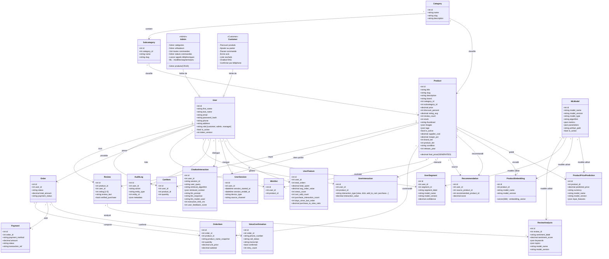

```mermaid
classDiagram
    class User {
        +int id
        +string first_name
        +string last_name
        +string email
        +string password_hash
        +string phone
        +string address
        +string role [customer, admin, manager]
        +bool is_active
        +int token_version
    }

    class Category {
        +int id
        +string name
        +string slug
        +string description
    }

    class Subcategory {
        +int id
        +int category_id
        +string name
        +string slug
    }

    class Product {
        +int id
        +string title
        +string slug
        +string description
        +string brand
        +int category_id
        +int subcategory_id
        +decimal price
        +int discount_percent
        +decimal final_price (GENERATED)
        +decimal rating_avg
        +int review_count
        +int stock
        +string thumbnail
        +json images
        +json tags
        +bool is_active
        +decimal supplier_cost
        +decimal margin_pct
        +int brand_tier
        +int product_tier
        +string condition
        +int release_year
    }

    class Review {
        +int id
        +int product_id
        +int user_id
        +int rating [1-5]
        +string review_text
        +bool verified_purchase
    }

    class CartItem {
        +int id
        +int user_id
        +int product_id
        +int quantity
    }

    class Order {
        +int id
        +int user_id
        +string status
        +decimal total_amount
        +string payment_status
    }

    class OrderItem {
        +int id
        +int order_id
        +int product_id
        +string product_name_snapshot
        +int quantity
        +decimal unit_price
        +decimal subtotal
    }

    class Payment {
        +int id
        +int order_id
        +string payment_method
        +decimal amount
        +string status
        +string transaction_ref
    }

    class Wishlist {
        +int id
        +int user_id
        +int product_id
    }

    class UserInteraction {
        +int id
        +int user_id
        +int product_id
        +string interaction_type [view, click, add_to_cart, purchase...]
        +decimal interaction_value
    }

    class Recommendation {
        +int id
        +int user_id
        +int source_product_id
        +int recommended_product_id
        +decimal score
    }

    class ReviewAnalysis {
        +int id
        +int review_id
        +string sentiment_label
        +decimal sentiment_score
        +json keywords
        +json topics
        +string model_name
        +string model_version
    }

    class ProductEmbedding {
        +int id
        +int product_id
        +string model_name
        +string model_version
        +vector(384) embedding_vector
    }

    class VoiceConfirmation {
        +int id
        +int order_id
        +string phone_number
        +string call_status
        +string transcript
        +bool confirmed
        +int retry_count
    }

    class AuditLog {
        +int id
        +int user_id
        +string action
        +string entity_type
        +int entity_id
        +json metadata
    }

    class ChatbotInteraction {
        +int id
        +int user_id
        +string session_id
        +string user_query
        +string retrieval_algorithm
        +json retrieved_context
        +string llm_prompt
        +string llm_response
        +string llm_model_used
        +int execution_time_ms
        +int user_feedback_score
    }

    class MLModel {
        +int id
        +string model_name
        +string model_version
        +string model_type
        +string algorithm
        +json metrics
        +json parameters
        +string artifact_path
        +bool is_active
    }

    class UserFeature {
        +int id
        +int user_id
        +int total_orders
        +decimal total_spent
        +decimal avg_order_value
        +int views_count
        +int cart_add_count
        +int purchase_interaction_count
        +int days_since_last_order
        +decimal purchase_to_view_ratio
    }

    class UserSegment {
        +int id
        +int user_id
        +int segment_id
        +string segment_label
        +string model_name
        +string model_version
        +decimal confidence
    }

    class ProductPricePrediction {
        +int id
        +int product_id
        +decimal predicted_price
        +string currency
        +string model_name
        +string model_version
        +json input_features
    }

    class UserSession {
        +int id
        +int user_id
        +datetime session_started_at
        +datetime session_ended_at
        +string device_type
        +string source_channel
    }

    %% ─── CARDINALITÉS ───

    Category "1" --> "*" Subcategory : contient
    Category "1" --> "*" Product : classifie
    Subcategory "1" --> "*" Product : classifie

    User "1" --> "*" Review : écrit
    User "1" --> "*" CartItem : possède
    User "1" --> "*" Order : passe
    User "1" --> "*" Wishlist : liste
    User "1" --> "*" UserInteraction : génère
    User "1" --> "*" AuditLog : déclenche
    User "1" --> "*" ChatbotInteraction : dialogue
    User "1" --> "*" UserSession : navigue
    User "1" --> "1" UserFeature : a
    User "1" --> "*" UserSegment : segmenté

    Product "1" --> "*" Review : reçoit
    Product "1" --> "*" CartItem : dans panier
    Product "1" --> "*" OrderItem : commandé
    Product "1" --> "*" Wishlist : souhaité
    Product "1" --> "*" UserInteraction : interacté
    Product "1" --> "*" Recommendation : source
    Product "1" --> "*" Recommendation : recommandé
    Product "1" --> "1" ProductEmbedding : encodé
    Product "1" --> "*" ProductPricePrediction : prédit

    Order "1" --> "*" OrderItem : compose
    Order "1" --> "1" Payment : paie
    Order "1" --> "*" VoiceConfirmation : confirmé

    Review "1" --> "1" ReviewAnalysis : analysé

    MLModel "1" --> "*" ReviewAnalysis : modèle utilisé
    MLModel "1" --> "*" UserSegment : modèle utilisé
    MLModel "1" --> "*" ProductEmbedding : modèle utilisé
    MLModel "1" --> "*" ProductPricePrediction : modèle utilisé

    %% ─── ACTEURS ───

    class Admin {
        <<Admin>>
        - Gérer produits (CRUD)
        - Gérer catégories
        - Gérer utilisateurs
        - Voir toutes commandes
        - Gérer statuts commandes
        - Lancer appels téléphoniques
        - ML : modèles/segments/prix
    }

    class Customer {
        <<Customer>>
        - Parcourir produits
        - Ajouter au panier
        - Passer commande
        - Écrire avis
        - Liste souhaits
        - Chatbot RAG
        - Confirmer par téléphone
    }

    Admin --|> User : hérite de
    Customer --|> User : hérite de
```
