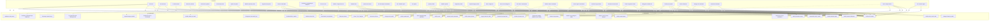

```mermaid
graph TB
    subgraph "👤 Customer"
        C1["S'inscrire"]
        C2["Se connecter"]
        C3["Se déconnecter"]
        C4["Parcourir produits"]
        C5["Rechercher produits"]
        C6["Voir détail produit"]
        C7["Ajouter au panier"]
        C8["Modifier quantité panier"]
        C9["Supprimer du panier"]
        C10["Passer commande"]
        C11["Confirmer commande par téléphone"]
        C12["Écrire un avis"]
        C13["Modifier / Supprimer avis"]
        C14["Chatbot RAG"]
        C15["Ajouter aux favoris"]
        C16["Voir historique commandes"]
        C17["Voir / Modifier profil"]
        C18["Voir panier"]
    end

    subgraph "🔧 Admin"
        A1["Ajouter produit"]
        A2["Modifier produit"]
        A3["Supprimer produit"]
        A4["Upload images produit"]
        A5["Gérer catégories"]
        A6["Gérer sous-catégories"]
        A7["Voir toutes commandes"]
        A8["Modifier statut commande"]
        A9["Lancer appel confirmation"]
        A10["Consulter logs chatbot"]
        A11["Recalculer features ML"]
        A12["Pusher segments clients"]
        A13["Enregistrer modèle ML"]
        A14["Prédire prix produit"]
        A15["Gérer utilisateurs"]
        A16["Changer rôle utilisateur"]
        A17["Désactiver utilisateur"]
        A18["Créer compte admin"]
        A19["Voir contexte appel"]
    end

    subgraph "<<include>> (obligatoire)"
        I1["Vérifier email unique"]
        I2["Hasher mot de passe (bcrypt)"]
        I3["Générer token JWT"]
        I4["Révoquer tokens"]
        I5["Vérifier stock"]
        I6["Vérifier produit actif"]
        I7["Calculer total commande"]
        I8["Vérifier achat (review)"]
        I9["Authentifier (JWT cookie)"]
        I10["Vérifier rôle admin"]
        I11["Vérifier transition statut"]
        I12["Restaurer stock si annulation"]
        I13["Recherche hybride (BM25+Vector+RRF)"]
        I14["Générer réponse LLM"]
        I15["Construire prompt RAG"]
        I16["Logger interaction DB"]
        I17["Vérifier numéro téléphone"]
        I18["Vérifier doublon appel"]
        I19["Charger features produit"]
        I20["Recherche full-text"]
        I21["Filtrer / Trier / Paginer"]
        I22["Charger avis produit"]
        I23["Créer enregistrement paiement"]
        I24["Vérifier sous-catégorie valide"]
        I25["Générer slug unique"]
        I26["Vérifier token service ML"]
        I27["Rate limiter (10 req/15min)"]
    end

    subgraph "<<extend>> (optionnel)"
        E1["Upload images produits"]
        E2["Confirmer commande par téléphone"]
        E3["Réessayer appel (retry)"]
        E4["Notifier admin par email"]
        E5["Enregistrer dans audit_logs"]
        E6["Log interaction ML (background)"]
        E7["Appliquer code promo"]
        E8["Soft-delete si lié à commande"]
        E9["S'authentifier en admin"]
    end

    %% ─── CUSTOMER → INCLUDE ───

    C1 -->|<<include>>| I1
    C1 -->|<<include>>| I2
    C1 -->|<<include>>| I3
    C1 -->|<<include>>| I27

    C2 -->|<<include>>| I9
    C2 -->|<<include>>| I27

    C3 -->|<<include>>| I4

    C4 -->|<<include>>| I21
    C5 -->|<<include>>| I20
    C5 -->|<<include>>| I21
    C6 -->|<<include>>| I22

    C7 -->|<<include>>| I5
    C7 -->|<<include>>| I6
    C8 -->|<<include>>| I5

    C10 -->|<<include>>| I5
    C10 -->|<<include>>| I6
    C10 -->|<<include>>| I7
    C10 -->|<<include>>| I23

    C12 -->|<<include>>| I8
    C13 -->|<<include>>| I9

    C14 -->|<<include>>| I13
    C14 -->|<<include>>| I14
    C14 -->|<<include>>| I15
    C14 -->|<<include>>| I16

    C16 -->|<<include>>| I9
    C17 -->|<<include>>| I9

    %% ─── ADMIN → INCLUDE ───

    A1 -->|<<include>>| I9
    A1 -->|<<include>>| I10
    A1 -->|<<include>>| I24
    A1 -->|<<include>>| I25

    A2 -->|<<include>>| I9
    A2 -->|<<include>>| I10
    A2 -->|<<include>>| I24

    A3 -->|<<include>>| I9
    A3 -->|<<include>>| I10

    A5 -->|<<include>>| I9
    A5 -->|<<include>>| I10

    A6 -->|<<include>>| I9
    A6 -->|<<include>>| I10

    A7 -->|<<include>>| I9
    A7 -->|<<include>>| I10

    A8 -->|<<include>>| I9
    A8 -->|<<include>>| I10
    A8 -->|<<include>>| I11

    A9 -->|<<include>>| I9
    A9 -->|<<include>>| I10
    A9 -->|<<include>>| I17
    A9 -->|<<include>>| I18

    A10 -->|<<include>>| I9
    A10 -->|<<include>>| I10

    A11 -->|<<include>>| I9
    A11 -->|<<include>>| I10

    A12 -->|<<include>>| I9
    A12 -->|<<include>>| I10

    A13 -->|<<include>>| I9
    A13 -->|<<include>>| I10

    A14 -->|<<include>>| I9
    A14 -->|<<include>>| I10
    A14 -->|<<include>>| I19
    A14 -->|<<include>>| I26

    A15 -->|<<include>>| I9
    A15 -->|<<include>>| I10

    A16 -->|<<include>>| I9
    A16 -->|<<include>>| I10

    A17 -->|<<include>>| I9
    A17 -->|<<include>>| I10

    A18 -->|<<include>>| I9
    A18 -->|<<include>>| I10
    A18 -->|<<include>>| I1
    A18 -->|<<include>>| I2

    A19 -->|<<include>>| I9
    A19 -->|<<include>>| I10

    %% ─── EXTEND ───

    A1 -.->|<<extend>>| E1
    A2 -.->|<<extend>>| E1
    A3 -.->|<<extend>>| E8
    C10 -.->|<<extend>>| E2
    C11 -.->|<<extend>>| E3
    A8 -.->|<<extend>>| I12
    A8 -.->|<<extend>>| E4
    A14 -.->|<<extend>>| E5
    C14 -.->|<<extend>>| E6
    C10 -.->|<<extend>>| E7
    A18 -.->|<<extend>>| E9
```
